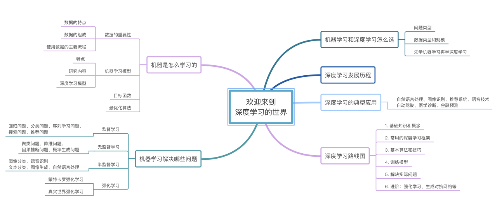

# Chapter-01 欢迎来到深度学习的世界

* [1-1 欢迎来到深度学习的世界](./1-1 欢迎来到深度学习的世界.ipynb)
* [1-2 机器是怎么学习的](./1-2 机器是怎么学习的.ipynb)
* [1-3 机器学习解决哪些问题](./1-3 机器学习解决哪些问题.ipynb)
* [1-4 机器学习和深度学习怎么选](./1-4 机器学习和深度学习怎么选.ipynb)
* [1-5 深度学习的发展历程](./1-5 深度学习的发展历程.ipynb)
* [1-6 深度学习的典型应用](./1-6 深度学习的典型应用.ipynb)
* [1-7 深度学习路线图](./1-7 深度学习路线图.ipynb)
* [1-8 本门课程的主要特点](./1-8 本门课程的主要特点.ipynb)
* [1-9 本章小结](./1-9 本章小结.ipynb)

**本章脑图**

